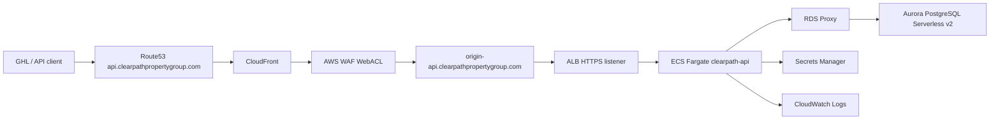

# Clearpath Lead Intelligence API

Containerized REST API on ECS Fargate, Aurora PostgreSQL Serverless v2, RDS Proxy, CloudFront, Route53, WAF, and Secrets Manager.

This repository is built as a portfolio-grade AWS Terraform project for Clearpath Property Group's off-market real estate lead workflow. It is intentionally small at the application layer: the infrastructure is the story.

## Deployment Status

This repo is currently built and validated locally only. Do not run `terraform apply` until you intentionally want to create billable AWS resources.

## Why This Architecture

| Service | Why not the alternative |
|---|---|
| ECS Fargate | GHL webhooks need warm, predictable responses. Lambda in a VPC can introduce cold-start latency, and future scoring jobs may exceed Lambda's runtime model. |
| Aurora PostgreSQL Serverless v2 | Lead, property, and follow-up data is relational and benefits from joins. DynamoDB is not the right primary shape for this workflow. |
| RDS Proxy | Fargate tasks create database connections; the proxy pools and protects Aurora from connection pressure. |
| CloudFront | Market snapshot responses are cacheable and should not hit Fargate or Aurora on every read. |
| Route53 | Provides real API and origin DNS routing for the CloudFront and ALB path. |
| ALB | Routes `/api/*`, `/webhooks/*`, and `/health` to ECS targets and terminates TLS at the regional origin. |
| Secrets Manager | RDS-managed database credentials and webhook HMAC secrets stay out of code and Terraform variable values. |
| WAF | AWS managed rules and webhook rate limiting protect the CloudFront edge. |

## Architecture



## Endpoints

- `POST /webhooks/ghl`
- `GET /api/leads?county=Gwinnett&status=warm&days_since_contact=30`
- `GET /api/market/gwinnett`
- `GET /health`

## Local Validation

```bash
.venv/bin/pytest app/tests
terraform -chdir=terraform/environments/dev init -backend=false
terraform -chdir=terraform/environments/dev validate
.venv/bin/checkov -d terraform/ --framework terraform --quiet
```

## Apply Gate

The intended workflow is always:

```bash
terraform -chdir=terraform/environments/dev plan -out=tfplan
terraform -chdir=terraform/environments/dev apply tfplan
```

Do not skip the plan review. Set `route53_zone_id` in `terraform/environments/dev/terraform.tfvars` before applying DNS/ACM resources.

## Cost Profile

The stack is designed for short demo windows and teardown. RDS Proxy is required for the architecture, but it can keep Aurora connections open and may prevent true idle auto-pause while active. For cost control, scale ECS to zero before demos end or destroy the stack.

| Service | Approximate demo cost driver |
|---|---|
| ECS Fargate | 2 small always-on tasks while deployed |
| Aurora Serverless v2 | ACU usage, with scale-to-zero configured where supported |
| RDS Proxy | Hourly proxy capacity |
| ALB | Hourly load balancer cost |
| CloudFront/WAF | Low traffic request and rule processing cost |

## CI/CD

GitHub Actions validates app tests and Terraform. Deployment is manual-gated with `workflow_dispatch` so a normal push cannot accidentally push an image or roll ECS.

GitLab CI mirrors Terraform validation for portfolio coverage.
