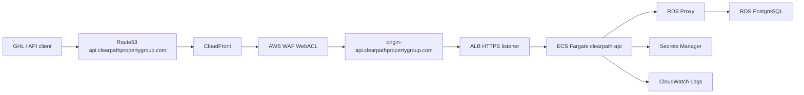

# Clearpath Lead Intelligence API

[](https://github.com/manynames3/clearpath-fargate-api/actions/workflows/build-push.yml)
[](https://github.com/manynames3/clearpath-fargate-api/actions/workflows/terraform-validate.yml)

Containerized REST API on ECS Fargate, RDS PostgreSQL, RDS Proxy, CloudFront, Route53, WAF, and Secrets Manager.

This repository is built as a portfolio-grade AWS Terraform project for Clearpath Property Group's off-market real estate lead workflow. It is intentionally small at the application layer: the infrastructure is the story.

## Deployment Status

This repo is currently built and validated locally only. Do not run `terraform apply` until you intentionally want to create billable AWS resources.

## Portfolio Demo Strategy

This project is designed to be deployed briefly, documented, and destroyed. The portfolio value is the architecture and Terraform implementation, not leaving ECS, ALB, RDS, RDS Proxy, NAT, CloudFront, and WAF running at idle.

For interviews, the strongest story is the cost-aware production tradeoff: RDS PostgreSQL is implemented because the current workload is modest and predictable, while Aurora is documented as the upgrade path for higher scale or availability requirements. That shows judgment instead of simply choosing the most expensive managed database.

Capture screenshots during one short AWS demo window, then tear the stack down:

- ECS service with healthy Fargate tasks
- ALB target group health
- RDS PostgreSQL instance in private subnets
- RDS Proxy target healthy
- CloudFront distribution with WAF attached
- `/api/market/*` cache behavior or response headers
- CloudWatch dashboard and alarms
- Terraform plan/apply/destroy output

See [docs/portfolio-demo.md](docs/portfolio-demo.md) for the short-lived deployment checklist.
Use [docs/demo-evidence-template.md](docs/demo-evidence-template.md) when capturing screenshots and command output.
Review [docs/cost-estimate.md](docs/cost-estimate.md) before opening an AWS demo window.

## Local Quick Start

The fastest portfolio demo is local Docker Compose: FastAPI plus Postgres, no AWS resources.

```bash
cp .env.example .env
make dev-detached
make seed
make smoke
```

Open:

- `http://localhost:8000/health`
- `http://localhost:8000/api/leads?county=Gwinnett&limit=5`
- `http://localhost:8000/api/market/gwinnett`

Stop and remove local containers:

```bash
make clean
```

If Docker is not installed, use the SQLite fallback:

```bash
make install
make seed-local
make dev-local
```

Then run the same `localhost:8000` API calls.

## Sample API Calls

```bash
curl -f http://localhost:8000/health
```

```bash
curl -f "http://localhost:8000/api/leads?county=Gwinnett&limit=5"
```

```bash
curl -f "http://localhost:8000/api/market/gwinnett"
```

```bash
curl -X POST http://localhost:8000/webhooks/ghl \
  -H "Content-Type: application/json" \
  -d '{
    "contact_id": "demo-webhook-001",
    "first_name": "Jordan",
    "last_name": "Carter",
    "phone": "+14045550199",
    "source": "sms",
    "status": "warm",
    "custom_fields": {
      "property_address": "25 Demo Ridge",
      "city": "Lawrenceville",
      "county": "Gwinnett",
      "state": "GA",
      "situation": "inherited"
    }
  }'
```

## Why This Architecture

| Service | Why not the alternative |
|---|---|
| ECS Fargate | GHL webhooks need warm, predictable responses. Lambda in a VPC can introduce cold-start latency, and future scoring jobs may exceed Lambda's runtime model. |
| RDS PostgreSQL | Lead, property, and follow-up data is relational and benefits from joins. DynamoDB is not the right primary shape for this workflow, and Aurora is more capacity than the current demo workload needs. |
| RDS Proxy | Fargate tasks create database connections; the proxy pools and protects the database from connection pressure. |
| CloudFront | Market snapshot responses are cacheable and should not hit Fargate or the database on every read. |
| Route53 | Provides real API and origin DNS routing for the CloudFront and ALB path. |
| ALB | Routes `/api/*`, `/webhooks/*`, and `/health` to ECS targets and terminates TLS at the regional origin. |
| Secrets Manager | RDS-managed database credentials and webhook HMAC secrets stay out of code and Terraform variable values. |
| WAF | AWS managed rules and webhook rate limiting protect the CloudFront edge. |

## RDS vs. Aurora Decision Rationale

This project currently uses standard RDS PostgreSQL because the expected workload is small and predictable: webhook ingestion, lead lookups, and cached county-level market reads. For this stage, RDS is the more cost-effective choice than Aurora because it can run on a modest provisioned instance, avoids Aurora capacity overhead, and still provides the relational database features the API needs.

The performance requirement is practical rather than extreme. The API needs fast responses for GoHighLevel webhooks and simple joined lead queries, but it does not yet need Aurora's distributed storage layer, read replicas, or high-throughput autoscaling. CloudFront also absorbs repeat traffic for `/api/market/*`, which reduces pressure on the application and database.

For production failover and high availability, RDS can be promoted to Multi-AZ when the project has real uptime requirements. That is a straightforward upgrade path without taking on Aurora-specific operational behavior too early. Aurora would make more sense later if lead volume grows materially, concurrent webhook traffic increases, read scaling becomes necessary, or the business needs stronger regional availability and faster failover characteristics.

Autoscaling is another tradeoff. Aurora Serverless can scale capacity more dynamically, but this API does not currently have spiky enough database demand to justify that complexity. A small provisioned RDS instance is easier to reason about, easier to estimate for demos, and cheaper for the expected volume. The project can revisit Aurora when traffic, scaling, or availability requirements are no longer served well by provisioned RDS.

## Production Upgrade Path

The demo defaults are intentionally cost-controlled. For a real production launch, keep the same service boundaries but harden the database and teardown settings:

- use `terraform/environments/dev/production.tfvars.example` as the starting override file
- set `rds_multi_az = true`
- choose a larger RDS class after load testing, such as `db.t4g.small` or `db.t4g.medium`
- set `rds_deletion_protection = true`
- set `rds_skip_final_snapshot = false` and provide `rds_final_snapshot_identifier`
- set `alb_deletion_protection = true`
- keep `rds.force_ssl = 1`
- keep RDS Proxy for Fargate connection pooling
- add alarms for CPU, storage, connections, latency, and free memory

Aurora PostgreSQL becomes the next database option if webhook volume, concurrent lead searches, read scaling, or failover requirements outgrow provisioned RDS.

## Architecture



## Endpoints

- `POST /webhooks/ghl`
- `GET /api/leads?county=Gwinnett&status=warm&days_since_contact=30`
- `GET /api/market/gwinnett`
- `GET /health`

## Local Validation

```bash
.venv/bin/pytest app/tests
terraform -chdir=terraform/environments/dev init -backend=false
terraform -chdir=terraform/environments/dev validate
.venv/bin/checkov -d terraform/ --framework terraform --quiet
```

## Apply Gate

The intended workflow is always:

```bash
terraform -chdir=terraform/environments/dev plan -out=tfplan
terraform -chdir=terraform/environments/dev apply tfplan
```

Do not skip the plan review. Set `route53_zone_id` in `terraform/environments/dev/terraform.tfvars` before applying DNS/ACM resources.

## Cost Profile

The stack is designed for short demo windows and teardown. RDS is the current database target because it keeps demo costs predictable while preserving a realistic relational architecture. For cost control, scale ECS to zero before demos end or destroy the stack.

| Service | Approximate demo cost driver |
|---|---|
| ECS Fargate | 2 small always-on tasks while deployed |
| RDS PostgreSQL | Small provisioned database instance while deployed |
| RDS Proxy | Hourly proxy capacity |
| ALB | Hourly load balancer cost |
| CloudFront/WAF | Low traffic request and rule processing cost |

Screenshot evidence should be stored under `docs/screenshots/` after the short AWS demo. Do not keep the stack running just to preserve screenshots.

## CI/CD

GitHub Actions validates app tests and Terraform. Deployment is manual-gated with `workflow_dispatch` so a normal push cannot accidentally push an image or roll ECS.

GitLab CI mirrors Terraform validation for portfolio coverage.
