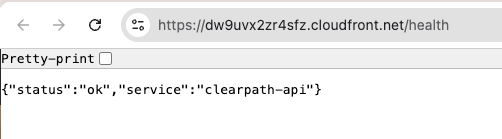
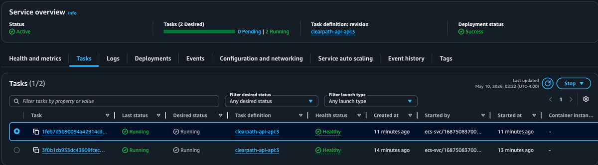
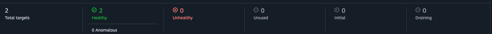
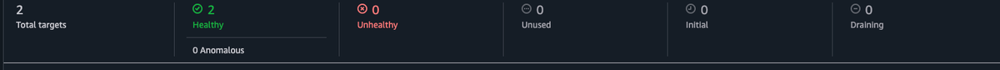
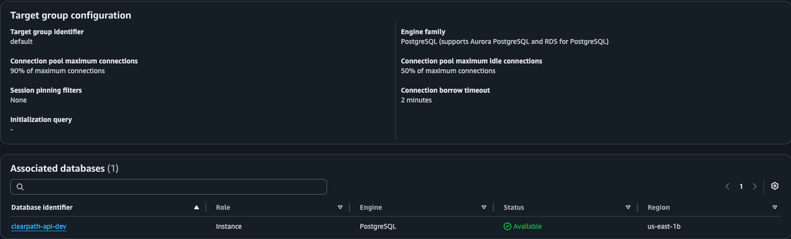
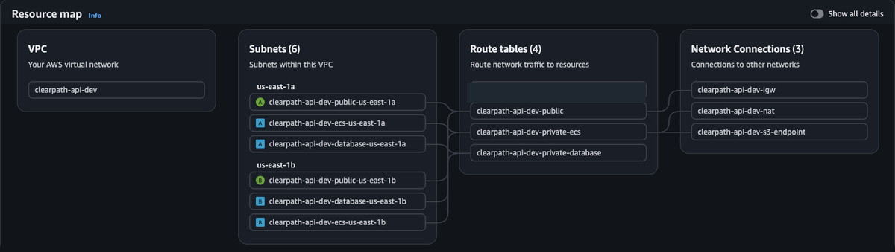
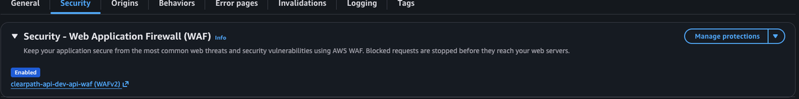
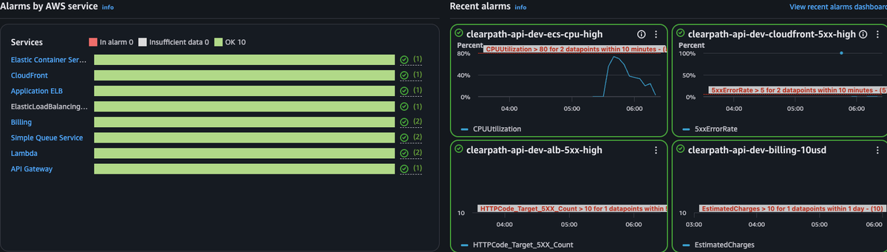
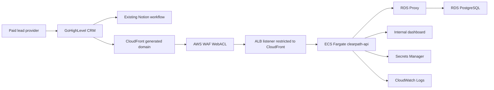

# Clearpath Lead Intelligence API

[](https://github.com/manynames3/clearpath-fargate-api/actions/workflows/build-push.yml)
[](https://github.com/manynames3/clearpath-fargate-api/actions/workflows/terraform-validate.yml)

Containerized REST API on ECS Fargate, RDS PostgreSQL, RDS Proxy, CloudFront, optional Route53, WAF, and Secrets Manager.

This repository is built as a production-pattern AWS Terraform project for Clearpath Property Group's paid off-market real estate lead workflow. It is intentionally small at the application layer: the infrastructure is the story. ECS Fargate is the primary AWS deployment path, with an optional Kubernetes/EKS manifest track in `k8s/`.

## Business Fit

Clearpath already uses GoHighLevel as the CRM. Paid lead providers send seller contact and property information into GHL, and GHL remains responsible for sales pipelines, automatic follow-up sequences, notifications, and Notion handoff workflows.

This API does not replace that CRM workflow. It receives a copy of the GHL workflow event and creates an independent, queryable lead intelligence layer in PostgreSQL. The practical end-user value is source accountability and lead analysis: which paid lead sources, counties, provider tags, and seller situations are worth buying again, and what county-level market context should be shown with each full-address lead.

In short: GHL runs the sales workflow; Clearpath Lead Intelligence API owns the structured reporting and market-context layer.

This is useful when the question is not "who should we call next?" but "what paid lead inventory is worth buying again?" The implemented API stores normalized lead and property records, protects reporting queries with an API key, accepts signed GHL-compatible webhook payloads, serves cached market snapshots, and exposes intelligence endpoints for source performance, lead scores, county performance, and data-quality checks.

The internal dashboard at `/dashboard` turns those API results into an operator-facing view: provider/source scorecard, hot/warm/dead breakdowns, newest leads with score reasons, market context by county, provider quality signals, and the current "needs review" queue.

## Deployment Status

This repo has been validated locally and through a short-lived AWS deployment. The AWS stack is currently destroyed to avoid ongoing ECS, ALB, RDS, RDS Proxy, NAT, CloudFront, WAF, and logging charges. Do not run `terraform apply` again until you intentionally want to create billable AWS resources.

## Live AWS Validation

A short-lived AWS validation run was completed on 2026-05-10 and torn down afterward with Terraform. The run validated the production-style deployment path:

- Terraform plan reviewed before apply; destroy completed with all Terraform-managed resources removed
- ECS Fargate service reached two healthy running tasks
- ALB API and webhook target groups reported healthy targets
- RDS PostgreSQL ran in private database subnets behind RDS Proxy
- CloudFront served the API health endpoint with WAF attached
- CloudWatch metrics and alarms were visible during the run
- VPC resource map showed public, private ECS, and private database subnet tiers

Curated screenshots from the validation run are included below. They are cropped/redacted for public use; raw AWS console screenshots are intentionally kept out of Git because they contain account metadata, ARNs, generated endpoints, private network identifiers, and secret ARNs. See [docs/live-validation-summary.md](docs/live-validation-summary.md) for the evidence summary and teardown notes.

The GoHighLevel work is accurately scoped as a GHL-compatible webhook receiver for lead intelligence, not a replacement for GHL follow-up automation. A live external GHL Workflow Custom Webhook still requires account/location access, workflow configuration, shared secret setup, and delivery-log evidence.

## AWS Evidence Gallery

| Evidence | Screenshot |
|---|---|
| CloudFront served the deployed `/health` endpoint |  |
| ECS Fargate service reached two healthy running tasks |  |
| ALB API target group reported healthy targets |  |
| ALB webhook target group reported healthy targets |  |
| RDS Proxy target group was attached to PostgreSQL |  |
| VPC resource map showed public, ECS, and database subnet tiers |  |
| CloudFront had WAF enabled |  |
| CloudWatch alarms and metrics were visible during validation |  |

The full public-safe screenshot set is listed in [docs/screenshots/live-validation](docs/screenshots/live-validation/README.md).

## Ephemeral Deployment Strategy

This project is designed to be deployed briefly, documented, and destroyed. The architectural value is the Terraform implementation and service design, not leaving ECS, ALB, RDS, RDS Proxy, NAT, CloudFront, and WAF running at idle.

The default AWS validation path does not require buying a domain. Terraform serves the API through CloudFront's generated `*.cloudfront.net` domain and keeps Route53/ACM custom-domain resources disabled unless `use_custom_domain = true` and a real hosted zone ID are provided.

The main database tradeoff is cost-aware and workload-driven: RDS PostgreSQL is implemented because the current workload is modest and predictable, while Aurora is documented as the upgrade path for higher scale or availability requirements.

During an intentional AWS validation run, capture the operational artifacts, then tear the stack down:

- ECS service with healthy Fargate tasks
- ALB target group health
- RDS PostgreSQL instance in private subnets
- RDS Proxy target healthy
- CloudFront distribution with WAF attached
- `/api/market/*` cache behavior or response headers
- CloudWatch dashboard and alarms
- Terraform plan/apply/destroy output

See [docs/deployment-validation.md](docs/deployment-validation.md) for the short-lived deployment checklist.
Use [docs/deployment-evidence-template.md](docs/deployment-evidence-template.md) when capturing screenshots and command output.
Use [docs/troubleshooting.md](docs/troubleshooting.md) for validation troubleshooting notes.
Review [docs/cost-estimate.md](docs/cost-estimate.md) before applying in AWS.
Review [docs/kubernetes.md](docs/kubernetes.md) for the Kubernetes/EKS track.
Use [docs/ghl-integration.md](docs/ghl-integration.md) for the GoHighLevel-ready webhook receiver, setup requirements, and payload mapping.
Use [docs/lead-scoring.md](docs/lead-scoring.md) for the rule-based scoring model, provider field mapping, and CSV backfill path.
Use [docs/github-deploy-setup.md](docs/github-deploy-setup.md) for the manual GitHub Actions image deployment path.
Use [docs/terraform-backend.md](docs/terraform-backend.md) before moving from local state to remote Terraform state.
See [docs/test-results.md](docs/test-results.md) for the latest local validation summary and deployed CloudFront smoke artifact.
See [docs/decisions](docs/decisions/README.md) for architecture decision records.

Before opening an AWS validation window, run:

```bash
make preflight
```

## Local Quick Start

The fastest local run is Docker Compose: FastAPI plus Postgres, no AWS resources.

```bash
cp .env.example .env
make dev-detached
make seed
make smoke
```

Open:

- `http://localhost:8000/health`
- `http://localhost:8000/dashboard`
- `http://localhost:8000/api/leads?county=Gwinnett&limit=5`
- `http://localhost:8000/api/market/gwinnett`

Stop and remove local containers:

```bash
make clean
```

If Docker is not installed, use the SQLite fallback:

```bash
make install
make seed-local
make dev-local
```

Then run the same `localhost:8000` API calls.

## Sample API Calls

```bash
curl -f http://localhost:8000/health
```

```bash
curl -f "http://localhost:8000/api/leads?county=Gwinnett&limit=5"
```

```bash
curl -f "http://localhost:8000/api/market/gwinnett"
```

```bash
curl -f "http://localhost:8000/api/intelligence/summary"
```

```bash
curl -f "http://localhost:8000/api/intelligence/source-performance"
```

```bash
curl -f "http://localhost:8000/api/intelligence/lead-scores?needs_review=true"
```

```bash
curl -X POST http://localhost:8000/webhooks/ghl \
  -H "Content-Type: application/json" \
  -d '{
    "contact_id": "sample-webhook-001",
    "first_name": "Jordan",
    "last_name": "Carter",
    "phone": "+14045550199",
    "source": "paid-lead-vendor-a",
    "status": "warm",
    "custom_fields": {
      "property_address": "25 Sample Ridge",
      "city": "Lawrenceville",
      "county": "Gwinnett",
      "state": "GA",
      "situation": "inherited"
    }
  }'
```

## Why This Architecture

### Runtime Decision

ECS Fargate is not required because the first version of this API has high traffic. A small webhook receiver could be cheaper on Lambda, API Gateway, or a managed app platform. Fargate is used here because the project is intentionally demonstrating a production-style container service on AWS: private tasks with no public IPs, ALB target groups, task roles, ECR image deployment, health checks, rolling deployments, deployment rollback controls, CloudWatch logs, and RDS Proxy integration.

That tradeoff is deliberate. For a tiny permanent production workload, the lowest-cost answer might be serverless. For this validation-oriented system, the goal is to show that the same small FastAPI application can be operated like a real containerized service and then destroyed after validation to control cost. Fargate becomes more directly justified if the service grows into longer-running enrichment jobs, source-quality analysis, scheduled vendor reporting, or other containerized workers that do not fit a simple request/response function model.

| Service | Why not the alternative |
|---|---|
| ECS Fargate | A small webhook could run on Lambda, but this repo intentionally demonstrates AWS container operations: private tasks, ALB routing, task roles, health checks, rolling deployments, CloudWatch logs, and RDS Proxy connectivity. |
| RDS PostgreSQL | Paid lead, property, source, and market data is relational and benefits from joins. DynamoDB is not the right primary shape for this reporting workflow, and Aurora is more capacity than the current workload needs. |
| RDS Proxy | Fargate tasks create database connections; the proxy pools and protects the database from connection pressure. |
| CloudFront | Market snapshot responses are cacheable and should not hit Fargate or the database on every read. |
| Route53 | Optional custom-domain layer. The default short validation run uses the generated CloudFront domain to avoid domain purchase and hosted-zone maintenance. |
| ALB | Routes `/api/*`, `/webhooks/*`, and `/health` to ECS targets. In no-domain mode, viewer TLS terminates at CloudFront and CloudFront reaches the ALB over HTTP from the managed origin-facing prefix list. |
| Secrets Manager | RDS-managed database credentials and webhook HMAC secrets stay out of code and Terraform variable values. |
| WAF | AWS managed rules and webhook rate limiting protect the CloudFront edge. |
| Kubernetes/EKS manifests | Included as an optional platform track for portable container operations. ECS remains the cost-controlled AWS deployment path. |

Detailed decision records are maintained in [docs/decisions](docs/decisions/README.md).

## RDS vs. Aurora Decision Rationale

This project currently uses standard RDS PostgreSQL because the expected workload is small and predictable: webhook ingestion, lead lookups, and cached county-level market reads. For this stage, RDS is the more cost-effective choice than Aurora because it can run on a modest provisioned instance, avoids Aurora capacity overhead, and still provides the relational database features the API needs.

The performance requirement is practical rather than extreme. The API needs fast responses for GoHighLevel webhooks and simple joined lead queries, but it does not yet need Aurora's distributed storage layer, read replicas, or high-throughput autoscaling. CloudFront also absorbs repeat traffic for `/api/market/*`, which reduces pressure on the application and database.

For production failover and high availability, RDS can be promoted to Multi-AZ when the project has real uptime requirements. That is a straightforward upgrade path without taking on Aurora-specific operational behavior too early. Aurora would make more sense later if lead volume grows materially, concurrent webhook traffic increases, read scaling becomes necessary, or the business needs stronger regional availability and faster failover characteristics.

Autoscaling is another tradeoff. Aurora Serverless can scale capacity more dynamically, but this API does not currently have spiky enough database demand to justify that complexity. A small provisioned RDS instance is easier to reason about, easier to estimate for short validation runs, and cheaper for the expected volume. The project can revisit Aurora when traffic, scaling, or availability requirements are no longer served well by provisioned RDS.

## Production Upgrade Path

The default dev settings are intentionally cost-controlled. For a real production launch, keep the same service boundaries but harden the database and teardown settings:

- use `terraform/environments/dev/production.tfvars.example` as the starting override file
- set `rds_multi_az = true`
- set `rds_backup_retention_days = 7` or higher based on recovery requirements
- choose a larger RDS class after load testing, such as `db.t4g.small` or `db.t4g.medium`
- set `rds_deletion_protection = true`
- set `rds_skip_final_snapshot = false` and provide `rds_final_snapshot_identifier`
- set `alb_deletion_protection = true`
- keep `rds.force_ssl = 1`
- keep RDS Proxy for Fargate connection pooling
- add alarms for CPU, storage, connections, latency, and free memory

Aurora PostgreSQL becomes the next database option if webhook volume, concurrent lead searches, read scaling, or failover requirements outgrow provisioned RDS.

## Architecture



## Network Architecture

The Terraform networking module builds a three-tier VPC in `us-east-1` across two Availability Zones. Public subnets only host internet-facing entry infrastructure. ECS tasks and RDS Proxy stay in private app subnets, and PostgreSQL stays in private database subnets with no default route to the internet.

| Tier | us-east-1a | us-east-1b | Resources | Routing |
|---|---|---|---|---|
| VPC | `10.0.0.0/16` | `10.0.0.0/16` | Shared network boundary | Tagged and flow-logged |
| Public | `10.0.1.0/24` | `10.0.2.0/24` | ALB, NAT gateway | `0.0.0.0/0` to Internet Gateway |
| Private app | `10.0.10.0/24` | `10.0.11.0/24` | ECS Fargate tasks, RDS Proxy, VPC endpoints | NAT for controlled egress; S3 and interface endpoints for AWS services |
| Private data | `10.0.20.0/24` | `10.0.21.0/24` | RDS PostgreSQL | Isolated route table, no internet default route |

Security group flow is intentionally narrow:

| From | To | Port | Control |
|---|---|---|---|
| CloudFront origin-facing prefix list | ALB | `80` default, `443` with custom-domain origin TLS | ALB does not accept arbitrary internet sources |
| ALB security group | ECS security group | `8000` | App traffic only from the load balancer |
| ECS security group | RDS Proxy security group | `5432` | Application connects through the proxy only |
| RDS Proxy security group | RDS security group | `5432` | Database accepts PostgreSQL only from RDS Proxy |
| ECS security group | VPC endpoint security group | `443` | Private access to AWS APIs used at runtime |

## Endpoints

- `POST /webhooks/ghl` - GoHighLevel-compatible contact webhook ingestion
- `GET /api/leads?county=Gwinnett&status=warm&days_since_contact=30` - protected reporting query with `X-Clearpath-API-Key` when configured
- `GET /api/market/gwinnett`
- `GET /api/intelligence/summary`
- `GET /api/intelligence/source-performance`
- `GET /api/intelligence/duplicates` - optional data-quality guardrail, not the primary product workflow
- `GET /api/intelligence/lead-scores`
- `GET /api/intelligence/county-performance`
- `GET /dashboard` - internal lead intelligence dashboard
- `GET /health`
- `GET /ready` - database readiness check

## Local Validation

```bash
make validate
```

Equivalent individual commands:

```bash
.venv/bin/pytest app/tests
terraform -chdir=terraform/environments/dev init -backend=false
terraform -chdir=terraform/environments/dev validate
.venv/bin/checkov -d terraform/ --framework terraform --quiet
```

## Database Migrations

The repo now includes an Alembic migration scaffold under `app/alembic/`. The initial revision mirrors `sql/schema.sql` and gives the project a production-style path for future schema changes. The short-lived AWS validation path still uses `scripts/migrate.sh` as a simple bootstrap script.

## Apply Gate

The intended workflow is always:

```bash
terraform -chdir=terraform/environments/dev plan -out=tfplan
terraform -chdir=terraform/environments/dev apply tfplan
```

Do not skip the plan review. Only set `route53_zone_id` in `terraform/environments/dev/terraform.tfvars` when intentionally enabling DNS/ACM custom-domain resources.

For the default no-domain validation path, keep `use_custom_domain = false` and use the generated API output after apply:

```bash
terraform -chdir=terraform/environments/dev output -raw api_base_url
```

## Deployment Validation Artifacts

When validating the stack in AWS, capture artifacts that show the build ran end to end:

| Evidence | What to show |
|---|---|
| Terraform plan/apply | Reviewed plan, successful apply, and outputs for ALB, CloudFront, RDS Proxy, and `api_base_url` |
| Network | VPC, six subnets across two AZs, route tables, NAT gateway, VPC endpoints, and VPC Flow Logs |
| Security groups | CloudFront to ALB, ALB to ECS, ECS to RDS Proxy, RDS Proxy to RDS |
| ECS/Fargate | Cluster, service, two running tasks, task definition, and CloudWatch logs |
| Database | RDS PostgreSQL private accessibility, encryption, Secrets Manager integration, and RDS Proxy healthy target |
| Edge | CloudFront distribution deployed, WAF attached, generated domain or optional custom-domain behavior, and `/api/market/*` cache hit |
| API | `/health`, `/ready`, `/webhooks/ghl`, protected `/api/leads`, `/api/intelligence/*`, `/api/market/gwinnett`, and `/dashboard` responses through `api_base_url` |
| Teardown | ECS scaled down, Terraform destroy completed, and billable resources removed |

After apply, collect read-only CLI evidence with:

```bash
make deployment-evidence
```

## Cost Profile

The stack is designed for short validation windows and teardown. RDS is the current database target because it keeps costs predictable while preserving a realistic relational architecture. For cost control, scale ECS to zero before validation ends or destroy the stack.

| Service | Approximate cost driver |
|---|---|
| ECS Fargate | 2 small always-on tasks while deployed |
| RDS PostgreSQL | Small provisioned database instance while deployed |
| RDS Proxy | Hourly proxy capacity |
| ALB | Hourly load balancer cost |
| CloudFront/WAF | Low traffic request and rule processing cost |

Validation screenshots should be stored under `docs/screenshots/` after AWS validation. Do not keep the stack running just to preserve images.

## CI/CD

GitHub Actions validates app tests and Terraform. Image deployment is manual-gated with `workflow_dispatch` and `deploy=true`, so a normal push cannot accidentally push an image or roll ECS. The preferred image path is GitHub Actions after Terraform has created ECR and ECS; local Docker is optional.

GitLab CI mirrors Terraform validation for CI coverage.
