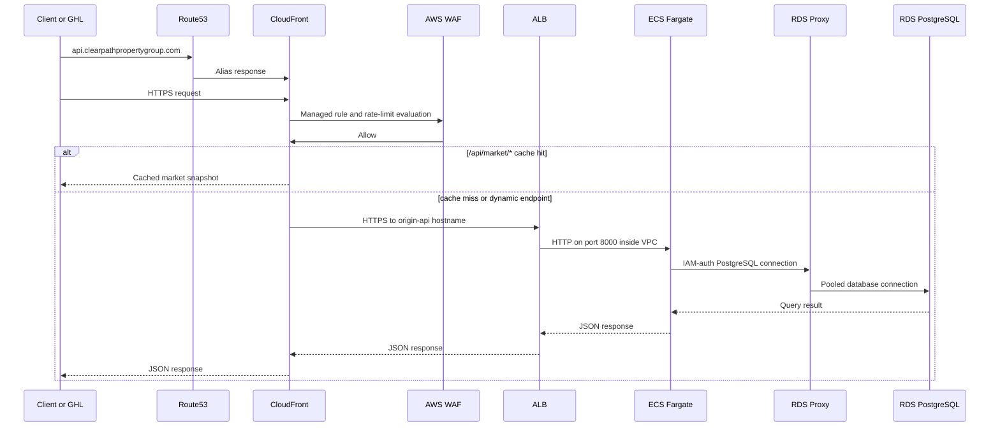

# Architecture

Clearpath Lead Intelligence API receives GoHighLevel contact webhooks, stores lead/property/follow-up data in RDS PostgreSQL, and serves query and market snapshot endpoints through CloudFront.

## Security Boundaries

The ALB security group accepts HTTPS only from the AWS-managed CloudFront origin-facing prefix list. ECS accepts port 8000 only from the ALB security group. RDS Proxy accepts PostgreSQL only from ECS, and the database accepts PostgreSQL only from RDS Proxy.

Runtime credentials are fetched from Secrets Manager. Terraform creates the GHL webhook secret container without writing a secret value into state; load the value out-of-band before starting the service.

## RDS vs. Aurora Decision Rationale

The current database choice is standard RDS PostgreSQL, not Aurora. Clearpath's present workload is modest: a few webhook writes, lead/property/follow-up joins, and market snapshot reads that are cached by CloudFront. RDS is the more cost-effective fit for this stage because it can run on a small provisioned instance with predictable pricing while still providing managed PostgreSQL, backups, encryption, Secrets Manager integration, and a clean path to production hardening.

The API does not currently need Aurora-level performance. The important path is fast webhook acknowledgement and straightforward relational queries, not high write throughput, global reads, or many read replicas. RDS PostgreSQL is enough for the expected lead volume, especially because `/api/market/*` is cacheable and should not repeatedly hit the database.

For production failover and high availability, the first upgrade would be RDS Multi-AZ. That gives the project a practical availability story without introducing Aurora's extra capacity model and operational surface before there is traffic to justify it. If the API later sees materially higher webhook volume, heavier concurrent lead searches, strict failover targets, or read-scaling requirements, Aurora PostgreSQL would become a reasonable next step.

Autoscaling is the main future tradeoff. Aurora Serverless can scale capacity more dynamically, but the current workload is not spiky enough to justify that complexity or cost. Provisioned RDS is simpler to size, easier to demo, and cheaper for the current stage; Aurora can be reconsidered when scaling or availability requirements outgrow that model.
