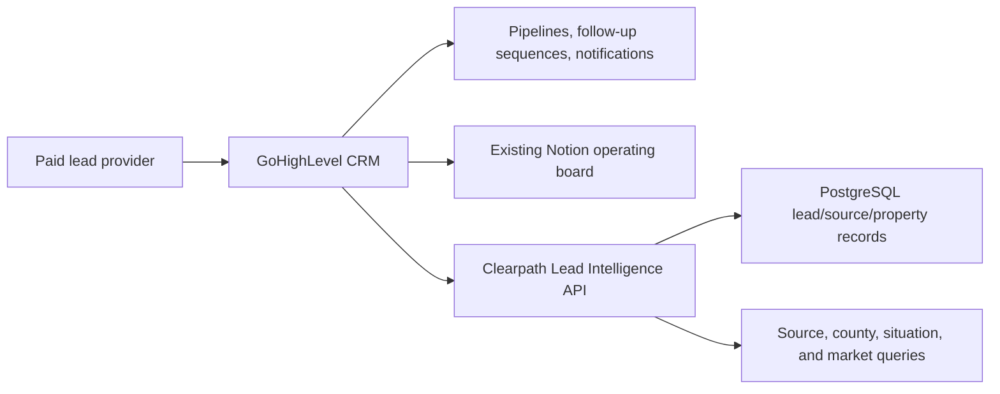
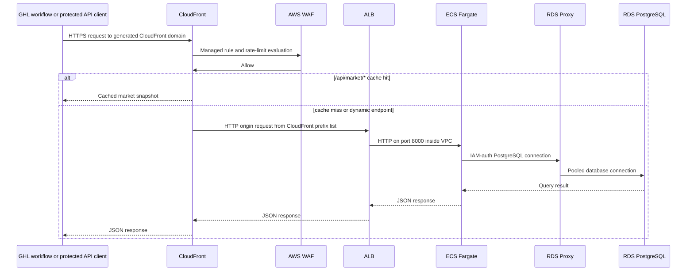
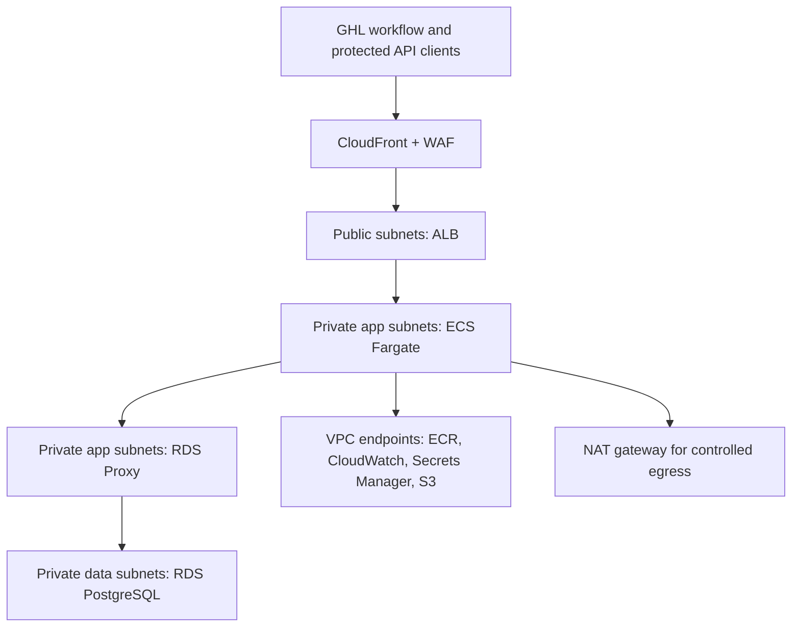

# Architecture

Clearpath Lead Intelligence API exposes a GoHighLevel-compatible webhook receiver, stores paid lead/property/source data in RDS PostgreSQL, and serves query and market snapshot endpoints through CloudFront.

The intended GoHighLevel connection is a Workflow Custom Webhook that posts contact and property fields to `/webhooks/ghl`; see [ghl-integration.md](ghl-integration.md) for payload mapping, webhook authentication, and the external GHL setup still required for live delivery. GHL remains the CRM automation layer for pipelines, follow-up sequences, notifications, and Notion workflows. This API is the separate intelligence layer for source accountability, reporting, and market context.

Architecture decision records are maintained in [decisions](decisions/README.md).

## Business Workflow

Paid lead providers already deliver motivated-seller leads into GoHighLevel. The API fits after that intake, as a second workflow action that receives the same lead event GHL is already using for CRM automation.

The end user benefit is not another follow-up system. The benefit is a clean data layer for questions such as which lead source is worth buying again, which counties produce usable opportunities, which seller situations are common, and whether every purchased lead was captured into the reporting store.

## Runtime Decision

The current workload does not strictly require ECS Fargate. A low-volume webhook receiver and reporting API could run on Lambda or another lower-idle-cost platform. This project uses Fargate because the architecture goal is a production-style AWS container service: private subnet tasks, ALB target registration, task roles, ECR image deployment, health checks, rolling deployments, rollback controls, CloudWatch logs, and RDS Proxy database access.

That distinction matters in design reviews. The defensible claim is not that GHL webhook volume requires Fargate on day one. The defensible claim is that this repo demonstrates container platform operations around a small, realistic business API, with explicit cost controls and teardown documentation. If the intelligence layer later adds batch enrichment, source-quality analysis, or scheduled vendor reporting workers, the container runtime becomes more directly useful.

## Security Boundaries

The default validation path uses CloudFront's generated `*.cloudfront.net` domain, so no Route53 hosted zone or purchased domain is required. Viewer TLS terminates at CloudFront. CloudFront reaches the ALB over HTTP because the ALB generated hostname cannot use a project-owned ACM certificate. The ALB security group still accepts traffic only from the AWS-managed CloudFront origin-facing prefix list, and the optional origin header rule can further reduce direct-origin access.

Custom-domain mode is still supported by setting `use_custom_domain = true`, providing a real `route53_zone_id`, and using ACM/Route53 records for both the public API alias and ALB origin alias.

ECS accepts port 8000 only from the ALB security group. RDS Proxy accepts PostgreSQL only from ECS, and the database accepts PostgreSQL only from RDS Proxy.

Runtime credentials are fetched from Secrets Manager. Terraform creates the GHL webhook secret container without writing a secret value into state; load the value out-of-band before starting the service.

## Network Architecture

The deployed network is a three-tier VPC in `us-east-1` with two Availability Zones. The public tier handles ingress and controlled egress. The private app tier runs the container workload and RDS Proxy. The private data tier contains PostgreSQL and has no internet default route.

| Tier | us-east-1a | us-east-1b | Resources | Routing |
|---|---|---|---|---|
| VPC | `10.0.0.0/16` | `10.0.0.0/16` | Shared network boundary | VPC Flow Logs enabled |
| Public | `10.0.1.0/24` | `10.0.2.0/24` | ALB, NAT gateway | Internet Gateway route |
| Private app | `10.0.10.0/24` | `10.0.11.0/24` | ECS Fargate, RDS Proxy, VPC endpoints | NAT plus private AWS service endpoints |
| Private data | `10.0.20.0/24` | `10.0.21.0/24` | RDS PostgreSQL | Isolated database route table |

Security group rules mirror the same path:

| Rule | Source | Destination | Port |
|---|---|---|---|
| ALB ingress | CloudFront origin-facing managed prefix list | ALB SG | `80` default, `443` with custom-domain origin TLS |
| App ingress | ALB SG | ECS SG | `8000` |
| Proxy ingress | ECS SG | RDS Proxy SG | `5432` |
| Database ingress | RDS Proxy SG | RDS SG | `5432` |
| Runtime AWS APIs | ECS SG | VPC endpoint SG | `443` |

## RDS vs. Aurora Decision Rationale

The current database choice is standard RDS PostgreSQL, not Aurora. Clearpath's present workload is modest: a few webhook writes, lead/property/source reporting queries, and market snapshot reads that are cached by CloudFront. RDS is the more cost-effective fit for this stage because it can run on a small provisioned instance with predictable pricing while still providing managed PostgreSQL, backups, encryption, Secrets Manager integration, and a clean path to production hardening.

The API does not currently need Aurora-level performance. The important path is fast webhook acknowledgement and straightforward relational queries, not high write throughput, global reads, or many read replicas. RDS PostgreSQL is enough for the expected lead volume, especially because `/api/market/*` is cacheable and should not repeatedly hit the database.

For production failover and high availability, the first upgrade would be RDS Multi-AZ. That gives the project a practical availability story without introducing Aurora's extra capacity model and operational surface before there is traffic to justify it. If the API later sees materially higher webhook volume, heavier concurrent lead searches, strict failover targets, or read-scaling requirements, Aurora PostgreSQL would become a reasonable next step.

Autoscaling is the main future tradeoff. Aurora Serverless can scale capacity more dynamically, but the current workload is not spiky enough to justify that complexity or cost. Provisioned RDS is simpler to size, easier to validate, and cheaper for the current stage; Aurora can be reconsidered when scaling or availability requirements outgrow that model.
