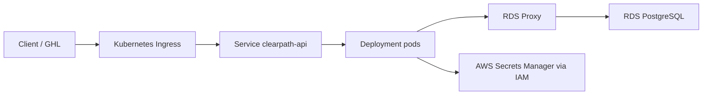

# Kubernetes Track

This repository keeps ECS Fargate as the implemented AWS deployment path and adds Kubernetes as an optional platform track. That is intentional: ECS/Fargate provides AWS-native container operations, while the Kubernetes manifests show the same API can run on a standard orchestrator such as EKS.

No EKS cluster is deployed by default. EKS has a control plane cost and adds operational overhead, so the Kubernetes layer is source-only until there is a deliberate validation window.

## What Is Included

The `k8s/` directory contains Kustomize manifests for:

- Namespace
- ServiceAccount
- ConfigMap-driven runtime settings
- Deployment with readiness/liveness probes
- ClusterIP Service
- HorizontalPodAutoscaler
- PodDisruptionBudget
- NetworkPolicy
- EKS overlay with AWS Load Balancer Controller Ingress annotations
- Local overlay for kind/minikube health checks

## Architecture



## Local Kubernetes Validation

Render the local and EKS overlays without connecting to a cluster:

```bash
make validate-k8s
```

This target uses `kubectl kustomize` or `kustomize build` when either tool is installed. If neither tool is available, it prints a warning and skips render validation.

The local overlay is intended for a quick Kubernetes smoke test. It skips database initialization so `/health` can prove the container, probes, Service, and Deployment work without running AWS resources.

Example flow after installing Docker and either kind or minikube:

```bash
docker build -t clearpath-api:local app/
kind load docker-image clearpath-api:local
kubectl apply -k k8s/overlays/local
kubectl -n clearpath-api rollout status deployment/clearpath-api
kubectl -n clearpath-api port-forward service/clearpath-api 8000:80
curl -f http://localhost:8000/health
```

For minikube, build the image inside minikube's Docker environment or push it to a registry available to the cluster.

## EKS Notes

The EKS overlay is intentionally not plug-and-play until real AWS values are inserted:

- ECR image URI
- RDS Proxy endpoint
- database secret ARN
- GHL webhook secret ARN
- IAM permissions for pods to call Secrets Manager and RDS IAM auth

For production EKS, use IAM Roles for Service Accounts or EKS Pod Identity rather than static AWS credentials. The Kubernetes ServiceAccount should be bound to an IAM role with the same narrow permissions used by the ECS task role:

- `secretsmanager:GetSecretValue`
- `secretsmanager:DescribeSecret`
- `kms:Decrypt` for the relevant secret KMS keys
- `rds-db:connect` for the exact database user through RDS Proxy

## Why Keep ECS Too?

Keeping both tracks documents two practical container deployment options:

- ECS Fargate shows AWS-native production container deployment.
- Kubernetes manifests show orchestrator literacy: probes, HPA, PDB, NetworkPolicy, Service, Ingress, overlays.
- The repo avoids paying for EKS until an EKS deployment is intentionally needed.
- ECS remains the cost-controlled AWS path, while EKS/Kubernetes is the option when a team needs Kubernetes-standard operations.

## Platform Decision

The main deployment path is ECS Fargate because it is cost-effective and AWS-native for this API. The Kubernetes/EKS track provides portable container operations through Deployment health probes, autoscaling, disruption budgets, network policy, and ingress. EKS becomes the better fit if the organization standardizes on Kubernetes or needs platform-level consistency across services; it is not required for a small standalone API by default.
